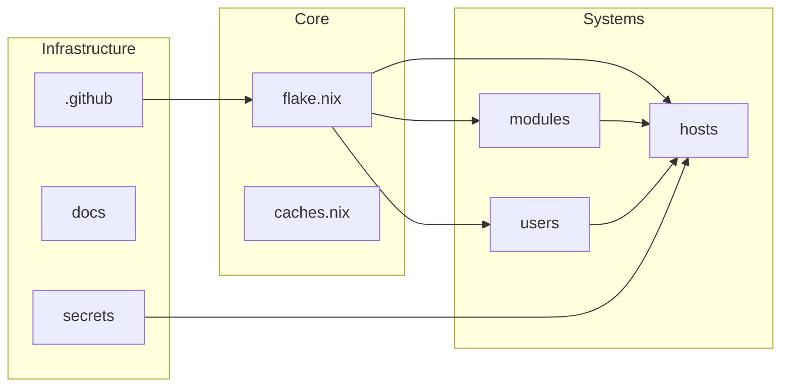

# nixOS - An indubitably splendiferous configuration     

- [nixOS - An indubitably splendiferous configuration     ](#nixos---an-indubitably-splendiferous-configuration-----)
  - [(Some) available program options](#some-available-program-options)
  - [Layout](#layout)
  - [Screenshots](#screenshots)

A modular NixOS + Home Manager configuration. It is easily extensible but comes with the following opinionated default setup:

- A Wayland display server running the niri compositor, with auto-login via greetd.
- Various Wayland amenities such as waybar, swayidle, swaync, swayosd, etc.
- Vicinae as the app launcher (lovely UI by the way).
- Ghostty with the Zsh shell and Starship prompt.
- Helix as a TUI and Zed as a GUI editor.
- Yazi as a TUI and Dolphin as a GUI file explorer.
- An extensively configured Zen Browser setup / BrowserOS.
- And much, much, more...

> [!NOTE]
> The main host in this repository is `lyra`.

## (Some) available program options

More are available (that I've added myself to the code but not the below concise documentation), but these are the main ones. And it is, of course, trivial to add your own.

> [!IMPORTANT]
> Values are the file name without `.nix`.

Desktop session

| Key in `userVars.programs` | Available values | Upstream                                                       |
|----------------------------|------------------|----------------------------------------------------------------|
| `compositor`               | `niri`           | [niri](https://github.com/YaLTeR/niri)                         |
| `display-server`           | `wayland`        | [wayland](https://wayland.freedesktop.org/)                    |
| `bar`                      | `waybar`         | [Waybar](https://github.com/Alexays/Waybar)                    |
| `idler`                    | `swayidle`       | [swayidle](https://github.com/swaywm/swayidle)                 |
| `launcher`                 | `vicinae`        | [Vicinae](https://vicinae.com/)                                |
| `login-manager`            | `greetd`         | [greetd](https://github.com/kennylevinsen/greetd)              |
| `logout-menu`              | `wleave`         | [wleave](https://github.com/AMenon2003/wleave)                 |
| `notifications`            | `swaync`         | [swaync](https://github.com/ErikReider/SwayNotificationCenter) |
| `osd`                      | `swayosd`        | [swayosd](https://github.com/ErikReider/SwayOSD)               |

Apps and tools

| Key in `userVars.programs` | Available values   | Upstream                                                                            |
|----------------------------|--------------------|-------------------------------------------------------------------------------------|
| `browsers` (list)          | `browseros`, `zen` | [BrowserOS](https://browseros.com/), [Zen Browser](https://zen-browser.app/)        |
| `terminal`                 | `ghostty`          | [Ghostty](https://ghostty.org/)                                                     |
| `editor`                   | `hx`               | [Helix](https://helix-editor.com/)                                                  |
| `explorer-gui`             | `dolphin`, `nemo`  | [Dolphin](https://apps.kde.org/dolphin/), [Nemo](https://github.com/linuxmint/nemo) |
| `explorer-tui`             | `yazi`             | [Yazi](https://yazi-rs.github.io/)                                                  |
| `partition-manager`        | `kde`              | [KDE Partition Manager](https://apps.kde.org/partitionmanager/)                     |
| `system-monitor`           | `missioncenter`    | [Mission Center](https://missioncenter.io/)                                         |

Shell and prompt

| Key in `userVars.programs` | Available values | Upstream                         |
|----------------------------|------------------|----------------------------------|
| `shell`                    | `zsh`            | [Zsh](https://www.zsh.org/)      |
| `prompt`                   | `starship`       | [Starship](https://starship.rs/) |
| `visual`                   | `zeditor`        | [Zeditor](https://zeditor.dev/)  |

## Layout

Start with the [docs/README.md](docs/README.md) file to learn about this setup!

## Screenshots

TODO: Add screenshots or desktop previews here later :).