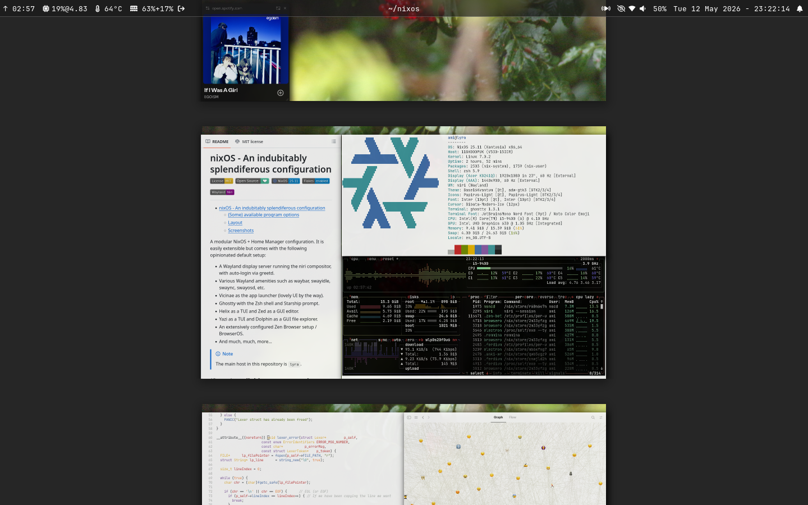

# nixOS - An indubitably splendiferous configuration

   

- [nixOS - An indubitably splendiferous configuration](#nixos---an-indubitably-splendiferous-configuration)
  - [Hosts](#hosts)
  - [Users](#users)
  - [Cachix](#cachix-)
  - [GitHub workflows](#github-workflows)
  - [Keyboard-centric workflow](#keyboard-centric-workflow)
    - [The navigation layers](#the-navigation-layers)
    - [Kanata usage](#kanata-usage)
    - [Waynav usage](#waynav-usage)
    - [Niri usage](#niri-usage)
    - [Nirius usage](#nirius-usage)
    - [Shell and clipboard scripts](#shell-and-clipboard-scripts)
  - [User configuration and scripts](#user-configuration-and-scripts)
    - [How scripts work across users](#how-scripts-work-across-users)
    - [ami's custom scripts and tools](#amis-custom-scripts-and-tools)
  - [(Some) available program options](#some-available-program-options)
  - [Screenshots](#screenshots)
  - [Inspirations and credits](#inspirations-and-credits)

> [!WARNING]
> The image above is _very_ out of date. I'll update it when Ghostty blur lands in stable, but be aware a lot of changes have occurred since that picture was taken (whoops!)

A modular NixOS + Home Manager configuration which aims to, among other things, facilitate keyboard-centric navigation (every relevant option has an equivalent mouse control though as I'm also still learning)! It is easily extensible but comes with the following opinionated default setup:

- A Wayland display server running the **niri** scrollable-tiling compositor, with auto-login via **greetd**.
- **Wayle** as the unified desktop shell (handling bar, notifications, and the OSD).
- **Vicinae** as the app launcher (an open-source launcher inspired by Raycast).
- **Ghostty** with **Zsh**, **Starship** prompt, and **Atuin** history.
- **Helix** as a TUI editor and **Zed** as a GUI editor.
- **Yazi** as a TUI and **Dolphin** as a GUI file explorer.
- A fully declarative **Zen Browser** configuration.
- Automatic light/dark theme switching using **Stylix** and **sunwait**.
- Secret encryption via **Agenix**.
- And much, much more...

This is the configuration that started my NixOS journey, and it has stayed with me ever since. Therefore, there may be some anti-patterns, and non idiomatic ways of doing things in my configuration that go against how you should "Nix". However, the configuration has served me well over the more than a year straight that I have used Nix, and considering the fact that it has been the only distro I have not switched back to Windows after using, I am satisfied. Plus, the way I configured it at the start was with modularity in mind, so there is actually barely any technical debt when editing it - thanks past me :3!

## Hosts

> [!NOTE]
> `hardware-configuration.nix` files are not committed to this repo (as per the .gitignore). However, they are themselves the exact file generated by Nix (down to the comments), so all you have to do is legitimately just copy over the new `hardware-configuration.nix` file with no changes at all. Configuration occurs in other files that import them, or other files which are imported - and in the case of the latter said files are committed to this repo.

| Hostname | Architecture   | Graphics | Notes           |
| -------- | -------------- | -------- | --------------- |
| `lyra`   | `x86_64-linux` | Intel    | CachyOS kernel. |

## Users

| Username | Description            | Default Shell | Desktop Environment                            |
| -------- | ---------------------- | ------------- | ---------------------------------------------- |
| `ami`    | Mah user               | `zsh`         | Niri + Wayle + Vicinae + Ghostty + Zen Browser |
| `rescue` | In case of kaboom user | `bash`        | Fallback system user so none                   |

## Cachix 

> [!IMPORTANT]
> "Users have a free 5 GB limit for open source projects and 20 Cachix Deploy agents." - [Cachix Pricing](https://www.cachix.org/pricing).

Before we go more in depth, I want to first state that I have a personal cache setup on [Cachix](https://cachix.org) under [skifli-nixos](https://app.cachix.org/cache/skifli-nixos) (yes it's free). This is extremely useful and I would suggest anyone reading this to also set one up (unless you have your own alternative already). 5 GB may not seem a lot but since in Cachix you can also configure upstream caches (i.e., they skip uploading store paths already present in any of them), 5 GB is plenty. Plus, you can pin specific paths to tell them not to delete (which they do based on a LRU policy if you are over 5 GB), and my pins are less than 4 GiB, so I have plenty of space!

I have a workflow setup under [`nix-build.yml`](.github/workflows/nix-build.yml) that builds when I tell it to (which used to be on push but sometimes I don't want / need it to), and caches anything built locally (i.e., not pulled from caches), and it also makes sure to pin my main system paths! This has helped bring my rebuild times down to an average of 2-3 minutes, which compared to the 10+ it was before is quite an improvement :p. Of course, my system is a bit complex with e.g., multiple specialisations for light / dark theme, Home Manager, etc, which mean it won't be the fastest to rebuild - but if anyone has any other ideas I'm all ears :).

## GitHub workflows

My configuration also uses some other GitHub Actions located in [`.github/workflows/`](.github/workflows/):

- [`flake-checker.yml`](.github/workflows/flake-checker.yml): Runs weekly checks on `flake.lock` health.
- [`nix-build.yml`](.github/workflows/nix-build.yml): As aforementioned, this builds the `lyra` system (for both light and dark theme specialisations), pushes the results directly to Cachix, and pins the latest two revisions.
- [`nix-maid.yml`](.github/workflows/nix-maid.yml): Runs [`statix`](https://github.com/molybdenumsoftware/statix), [`deadnix`](https://github.com/astro/deadnix), and [`alejandra`](https://github.com/kamadorueda/alejandra) on pushes/PRs, automatically opening a PR with the changes.
- [`update-lockfile.yml`](.github/workflows/update-lockfile.yml): Scheduled weekly run (Sundays at 00:00) that automatically updates `flake.lock` and opens an automated PR.
- [`dependabot.yml`](.github/dependabot.yml): Make sure the GitHub Actions dependencies are up to date, weekly.

## Keyboard-centric workflow

A major goal of this config is being able to control as close as possible to everything from the keyboard without needing to constantly move my hand for the mouse (this is also made harder by the fact I don't have half a finger)!

### The navigation layers

1. **Window & workspace level**: Controlled via [Niri](https://github.com/YaLTeR/niri) (`Mod + H/J/K/L` and arrow keys).
2. **Standard GUI applications without Vim keys**: Controlled via [Kanata](https://github.com/jtroo/kanata) mouse emulation (`Space` held + `E/S/D/F` for movement, `J/K/M` for clicks).
3. **Screen grid**: Controlled via [waynav](https://github.com/kovetskiy/waynav) (`Mod + ;` followed by quadrant keys `Q/W/A/S` and `Space` to click).
4. **Web browser navigation**: Controlled in [Zen Browser](https://zen-browser.app/) via the [Vimium-FF](https://addons.mozilla.org/en-GB/firefox/addon/vimium-ff/) extension (`f`, `F`, `d`, `u`, `gg`, `G`).
5. **Files, shell, and clipboard**: Via [Ghostty](https://ghostty.org/), [Yazi](https://yazi-rs.github.io/), and custom shell commands (`copyl`, `blammo`, `$blammo_in`).
6. **Global search and launching**: Handled via [Vicinae](https://vicinae.com/) (`Mod + D`), [Fuzzel](https://codeberg.org/dnkl/fuzzel), and custom layout scripts.

### Kanata usage

Configured in [`users/programs/keyboard/kanata.nix`](users/programs/keyboard/kanata.nix), with the default / current configuration (which is in [`users/ami/variables.nix`](users/ami/variables.nix)) being in a Lenovo Calliope UK ISO layout:

- **Activating mouse mode**: Tap `Space` to type a normal space. Hold `Space` (longer than 250ms) to activate mouse mode.
- **Toggle lock**: While in mouse mode, pressing `n` toggles mouse mode permanently ON so you don't have to keep holding space. Tap `n` again to unlock.
- **Left hand (movement and modifiers)**:
  - `E` / `S` / `D` / `F`: Move cursor Up / Left / Down / Right (with smooth acceleration).
  - `A`: Hold Shift (for shift-clicking or text selection).
  - `G`: Hold Ctrl (for multi-selection).
  - `Q`: Hold Super / Meta.
  - `T`: Hold Alt.
- **Right hand (clicks, scrolling, zoom)**:
  - `J`: Left click and drag (hold `J` while moving with `E/S/D/F` to drag-select).
  - `K`: Right click.
  - `M`: Middle click.
  - `I` / `O`: Scroll down / Scroll up.
  - `W` / `R`: Scroll left / Scroll right.
  - `L`: Hold for slow precision mode (movement set to 1px micro-steps).
  - `U` / `P`: Zoom in / Zoom out (`Ctrl+=` / `Ctrl+-` macros).

### Waynav usage

Configured in [`users/programs/misc/waynav.nix`](users/programs/misc/waynav.nix).

Press **`Mod + ;`** (Super + Semicolon) to spawn a fullscreen overlay on the focused monitor:

| Key / Keybinding      | Action                         | Description                                                            |
| :-------------------- | :----------------------------- | :--------------------------------------------------------------------- |
| `Mod + ;`             | **Activate waynav**            | Spawns the fullscreen 2 by 2 overlay on the active output.             |
| `Q` / `W`             | **Top-left / Top-right**       | Bisects the current target region into the upper quadrants.            |
| `A` / `S`             | **Bottom-left / Bottom-right** | Bisects the current target region into the lower quadrants.            |
| `G`                   | **3×3 grid mode**              | Splits the active region into a 3 by 3 grid for finer selection.       |
| `H` / `J` / `K` / `L` | **Vim nudge**                  | Micro-adjusts the target region left / down / up / right.              |
| `Space` / `Return`    | **Left click & exit**          | Warps the cursor to the target center, left-clicks, and closes waynav. |
| `D`                   | **Double click & exit**        | Warps and performs a double-click before exiting.                      |
| `R`                   | **Right click & exit**         | Warps and performs a right-click before exiting.                       |
| `M`                   | **Middle click & exit**        | Warps and performs a middle-click (e.g. to open links in new tabs).    |
| `Backspace`           | **History back**               | Reverts the last bisection step.                                       |
| `Escape` / `;`        | **Dismiss**                    | Closes the overlay immediately without clicking or warping.            |

### Niri usage

Configured in [`users/programs/compositor/niri/binds.nix`](users/programs/compositor/niri/binds.nix):

Focus and movement

| Keybinding                        | Action                                                                                          |
| :-------------------------------- | :---------------------------------------------------------------------------------------------- |
| `Mod + H` / `Mod + Left`          | Focus column left                                                                               |
| `Mod + L` / `Mod + Right`         | Focus column right                                                                              |
| `Mod + J` / `Mod + Down`          | Focus window down (in a vertical column)                                                        |
| `Mod + K` / `Mod + Up`            | Focus window up (in a vertical column)                                                          |
| `Mod + Ctrl + J` / `Down`         | Focus workspace down                                                                            |
| `Mod + Ctrl + K` / `Up`           | Focus workspace up                                                                              |
| `Mod + 1` / `Mod + Alt + H`       | Focus left monitor (`HDMI-A-2`)                                                                 |
| `Mod + 2` / `Mod + Alt + L`       | Focus right monitor (`DP-1`)                                                                    |
| `Mod + Shift + 1 .. 8`            | Jump straight to workspace 1 through 8                                                          |
| `Mod + Tab`                       | Smart overview (centers active workspaces)                                                      |
| `Mod + Shift + Tab`               | Standard overview toggle                                                                        |
| `Mod + A`                         | Interactive window switcher menu ([`window-switcher.sh`](users/ami/scripts/window-switcher.sh)) |
| `Alt + Tab` / `Alt + Shift + Tab` | Next / previous recent window                                                                   |
| `Alt + grave`                     | Focus next window on the current monitor                                                        |
| `Mod + Shift + H` / `Left`        | Move column left                                                                                |
| `Mod + Shift + L` / `Right`       | Move column right                                                                               |
| `Mod + Shift + J` / `Down`        | Move window down in column                                                                      |
| `Mod + Shift + K` / `Up`          | Move window up in column                                                                        |
| `Mod + Ctrl + Shift + J` / `Down` | Move column to workspace down                                                                   |
| `Mod + Ctrl + Shift + K` / `Up`   | Move column to workspace up                                                                     |
| `Mod + Shift + Home` / `End`      | Move column to first / last position                                                            |
| `Mod + Comma` / `Mod + Period`    | Consume window into column / Expel window from column                                           |
| `Mod + Alt + Shift + H/J/K/L`     | Nudge floating window 10% in direction                                                          |

Window sizing and column controls

| Keybinding                    | Action                                                         |
| :---------------------------- | :------------------------------------------------------------- |
| `Mod + W`                     | Toggle tabbed column view (stacks column vertically with tabs) |
| `Mod + Equal` (`+`)           | Increase column width (+10%)                                   |
| `Mod + Minus` (`-`)           | Decrease column width (-10%)                                   |
| `Mod + C`                     | Center column                                                  |
| `Mod + M`                     | Maximize column                                                |
| `Mod + F11`                   | Toggle fullscreen                                              |
| `Mod + Shift + F11`           | Toggle windowed fullscreen                                     |
| `Mod + O`                     | Toggle window floating                                         |
| `Mod + R` / `Mod + Shift + R` | Cycle preset column widths (forward / back)                    |
| `Mod + Ctrl + R` / `Shift`    | Cycle preset window heights (forward / back)                   |

App toggles (through find-or-make.sh)

The app toggle shortcuts will focus the application if already open, launch it if closed, or switch back to the previous window if the target is already focused (last one as per niri settings):

| Keybinding              | Application                                                                           |
| :---------------------- | :------------------------------------------------------------------------------------ |
| `Mod + D`               | Vicinae launcher                                                                      |
| `Mod + Return`          | Ghostty terminal                                                                      |
| `Mod + Shift + Return`  | Centered floating terminal ([`floating-term.sh`](users/ami/scripts/floating-term.sh)) |
| `Mod + ;`               | Grid-based mouse navigator and warper ([`waynav`](users/programs/misc/waynav.nix))    |
| `Mod + F`               | Dolphin file manager                                                                  |
| `Mod + Shift + F`       | Yazi file manager                                                                     |
| `Mod + V`               | Zed editor (`zeditor`)                                                                |
| `Mod + E`               | Helix editor (`hx`)                                                                   |
| `Mod + Shift + Z`       | Zen Browser (`zen-beta`)                                                              |
| `Mod + Shift + A`       | Anytype                                                                               |
| `Mod + Shift + N`       | Anki                                                                                  |
| `Mod + Shift + C`       | Ferdium                                                                               |
| `Mod + Shift + D`       | TigerVNC / FreeRDP                                                                    |
| `Mod + Shift + Y`       | Affinity suite                                                                        |
| `Ctrl + Shift + Escape` | Mission Center (`system-monitor`)                                                     |
| `Shift + Escape`        | Btop                                                                                  |
| `Mod + N`               | Todo and reminder manager ([`todo.sh`](users/ami/scripts/todo.sh))                    |
| `Mod + Q`               | Close focused window                                                                  |
| `Mod + Shift + Q`       | Force kill current window (`killcurrent`)                                             |
| `Mod + Ctrl + Q`        | Interactive click-to-kill window (`killclick`)                                        |

Layout preset scripts

| Keybinding       | Script                                     | Description                                                                                                                      |
| :--------------- | :----------------------------------------- | :------------------------------------------------------------------------------------------------------------------------------- |
| `Mod + Ctrl + 1` | [`1-niri.sh`](users/ami/scripts/1-niri.sh) | **Default layout**: Zen, Anki, Anytype, Ferdium, and TigerVNC arranged across both monitors.                                     |
| `Mod + Ctrl + 2` | [`2-niri.sh`](users/ami/scripts/2-niri.sh) | **NEA mode**: Evince PDF, Zed editor, SyncTeX daemon, and Zen Browser.                                                           |
| `Mod + Ctrl + 3` | [`3-niri.sh`](users/ami/scripts/3-niri.sh) | **F1iS mode**: Affinity suite, Zen, Anytype, and Ferdium.                                                                        |
| `Mod + Ctrl + 4` | [`4-niri.sh`](users/ami/scripts/4-niri.sh) | **Anki focus mode**: Stashes distraction apps into the scratchpad; places Anki on monitor 1, Zen and Anki Pomodoro on monitor 2. |

### Nirius usage

Configured using [`nirius`](https://sr.ht/~tsdh/nirius/):

| Keybinding        | Action                | Description                                                         |
| :---------------- | :-------------------- | :------------------------------------------------------------------ |
| `Mod + P`         | Toggle scratchpad     | Parks or unparks the focused window into the background scratchpad. |
| `Mod + Shift + P` | Cycle scratchpad      | Cycles through parked scratchpad windows one by one.                |
| `Mod + Ctrl + P`  | Toggle all scratchpad | Shows or hides all scratchpad windows at once.                      |
| `Mod + Alt + P`   | List scratchpad       | Sends a desktop notification listing all parked scratchpad windows. |
| `Mod + T`         | Toggle mark           | Tags/untags the focused window with a mark.                         |
| `Mod + Shift + T` | Focus marked          | Jumps straight to your marked window from anywhere.                 |
| `Mod + Alt + T`   | List marked           | Sends a desktop notification listing all marked windows.            |
| `Mod + Ctrl + F`  | Toggle follow mode    | Makes the focused window follow along when changing workspaces.     |

### Shell and clipboard scripts

Configured in [`users/programs/terminal-shell/zsh/initContent.sh`](users/programs/terminal-shell/zsh/initContent.sh):

- `copyl <file>`: Converts any local path into a `file:///` URI and copies it to the Wayland clipboard using `wl-clipboard`.
- `blammo` and `$blammo_in`: When selecting files in Yazi (`Mod + Shift + F`) and suspending (`Ctrl + Z`) or quitting (`q`), Yazi saves the selected paths into `/tmp/blammo`. The Zsh prompt automatically loads this into `$blammo_in` so you can do things like `copyl $blammo_in`, `ls -la $blammo_in`, or run batch operations on the file selection.
- `safe_reboot`: System shutdown or restart is auto blocked with a notification if a screen recording is active, a NixOS rebuild is running, or urgent windows need attention.

Nix and rebuild aliases (nh)

I use `nh` nearly all the time instead of raw `nixos-rebuild` commands:

| Alias   | Command(s)                                     | Usage                                                  |
| :------ | :--------------------------------------------- | :----------------------------------------------------- |
| `nsw`   | `nh os switch`                                 | Normal switch for daily config changes                 |
| `nup`   | `nh os switch --update`                        | Updates all flake inputs and switches at once          |
| `ntest` | `nh os test`                                   | Temporary switch (back to previous on reboot)          |
| `nboot` | `nh os boot`                                   | Build and set as default for the next boot only        |
| `ndry`  | `nh os switch --dry`                           | Dry run with inbuilt nvd package diff                  |
| `nask`  | `nh os switch --ask`                           | Shows visual package diff and prompts before switching |
| `nvm`   | `nh os build-vm`                               | QEMU sandbox build to test bigger changes              |
| `nfc`   | `nix flake check --no-build`                   | Tests the flake syntax without building                |
| `ncl`   | `nh clean all --keep 5`                        | Garbage collects old generations while keeping 5 safe  |
| `znsw`  | `z nixos && git pull && nh os switch`          | Syncs repo changes and switches                        |
| `znup`  | `z nixos && git pull && nh os switch -u`       | Syncs repo changes, updates flake inputs, and switches |
| `gfu`   | `git commit -m 'feat(flake.lock): update' ...` | Commit and push for updated lockfiles                  |

## User configuration and scripts

### How scripts work across users

The configuration handles user scripts in two ways so adding another user shouldn't be too much of a hassle:

1. **Standalone shell scripts** ([`users/ami/scripts/`](users/ami/scripts/)): Linked into `~/.local/bin/` by Home Manager.
2. **Inlined Nix scripts** ([`userVars.shellScripts`](users/ami/variables.nix)): Declared in each user's `variables.nix` and added to the user profile with `pkgs.writeShellScriptBin` (such as `killclick`, `killcurrent`, `qrscan`, `qrcreate`, and monitor focus helpers).

### ami's custom scripts and tools

The majority of these are bound to Niri keybinds, or are user systemd services:

CLI task scripts

- [`schedule.sh`](users/ami/scripts/schedule.sh): A CLI task scheduler (inspired by [axlefublr](https://github.com/Axlefublr)). You can queue commands from anywhere (`schedule <command>`), edit queued jobs in `$EDITOR`, check status (`schedule ls`), or look at stdout logs (`schedule logs <id>`).
- [`task-receiver.sh`](users/ami/scripts/task-receiver.sh): A background daemon that listens for pending tasks and runs them inside `systemd-run --user --scope` units. It listens to the Niri event stream to track spawned windows (like Ghostty), and if a task exits with an error, it opens a [`fuzzel`](https://codeberg.org/dnkl/fuzzel) dialog to retry, drop, or edit the command via [`vipe`](https://joeyh.name/code/moreutils/).

Niri related scripts

- [`niri-streamer.sh`](users/ami/scripts/niri-streamer.sh): A background listener for `niri msg --json event-stream`. It dispatches state changes to hooks under [`users/ami/scripts/hooks/`](users/ami/scripts/hooks/).
- [`hooks/urgency.sh`](users/ami/scripts/hooks/urgency.sh): A listener for urgent windows or workspaces that sends notifications through `notify-send`, clearing them once focused.
- [`1-niri.sh`](users/ami/scripts/1-niri.sh), [`2-niri.sh`](users/ami/scripts/2-niri.sh), [`3-niri.sh`](users/ami/scripts/3-niri.sh), [`4-niri.sh`](users/ami/scripts/4-niri.sh): One-key preset window layout scripts. Definitely overengineered :p. They make sure target apps are running, stash unused distraction windows into the [`nirius`](https://sr.ht/~tsdh/nirius/) scratchpad, and move columns across both monitors with proper widths.
- [`floating-term.sh`](users/ami/scripts/floating-term.sh): Spawns a centered floating terminal (Ghostty by default) with preset dimensions.
- [`smart-overview.sh`](users/ami/scripts/smart-overview.sh): An overview toggle script that automatically focuses vertically centered workspaces that are in use per monitor.
- [`window-switcher.sh`](users/ami/scripts/window-switcher.sh): A quick interactive window search and jump menu using [`fuzzel`](https://codeberg.org/dnkl/fuzzel).
- [`cast-picker.sh`](users/ami/scripts/cast-picker.sh): A selector to choose specific windows or entire monitors for the niri Dynamic Cast Target.
- [`colour-picker.sh`](users/ami/scripts/colour-picker.sh) / [`focused-window-info.sh`](users/ami/scripts/focused-window-info.sh) / [`focused-output-info.sh`](users/ami/scripts/focused-output-info.sh): Quick helpers that grab hex codes or window/output properties and send desktop notifications.

General scripts

- [`todo.sh`](users/ami/scripts/todo.sh): A TODO and reminder manager using [`fuzzel`](https://codeberg.org/dnkl/fuzzel). It supports relative and absolute timestamps, on-boot reminders, and overdue tracking. It uses a systemd timer (`--check`) for periodic desktop notifications.
- [`anki-pomodoro.sh`](users/ami/scripts/anki-pomodoro.sh): A 25/5 Pomodoro timer using [`termdown`](https://github.com/trehn/termdown). It automatically toggles DND mode using [`wayle`](https://github.com/wayle-shell/wayle) during focus rounds and un-mutes during breaks.
- [`record.sh`](users/ami/scripts/record.sh): A custom [`gpu-screen-recorder`](https://git.dec05eba.com/gpu-screen-recorder/about/) wrapper with region ([slurp](https://github.com/emersion/slurp)), portal, or monitor capture, and audio options. It includes a post-recording menu to compress with FFmpeg (H.265), copy to clipboard, delete, and / or open the folder.
- [`smart-rebuild.sh`](users/ami/scripts/smart-rebuild.sh): Spawns a floating terminal, pulls git updates, updates submodules, switches the NixOS flake with some custom limits, logs execution time, and can reboot or powers off after.
- [`theme-switcher.sh`](users/ami/scripts/theme-switcher.sh): For when I want to manually switch between light and dark system specialisations using `sudo switch-to-configuration test` so it doesn't clutter the bootloader generations.
- [`zen-keyboard-shortcuts.sh`](users/ami/scripts/zen-keyboard-shortcuts.sh): A custom tool that compares the shortcuts in the Nix config against Zen Browser's actual JSON file to make updating easier when there's a change to Zen's schema version.
- [`autoclicker.sh`](users/ami/scripts/autoclicker.sh): A script that uses [`ydotool`](https://github.com/ReimuNotMoe/ydotool) with preset speed modes (50ms, anti-AFK, 100-click bursts, or custom intervals).
- [`view-clipboard-image.sh`](users/ami/scripts/view-clipboard-image.sh): Quickly opens the copied image or file URI in [`swayimg`](https://github.com/artemsen/swayimg).
- [`rdp.sh`](users/ami/scripts/rdp.sh): Another [`fuzzel`](https://codeberg.org/dnkl/fuzzel) launcher for [FreeRDP](https://www.freerdp.com/) and [TigerVNC](https://tigervnc.org/) connecting to remote machines using credentials from [Agenix](https://github.com/ryantm/agenix).

## (Some) available program options

More are available (that I've added myself to the code but not the below concise list), but these are the main ones. And it is, of course, trivial to add your own.

> [!IMPORTANT]
> Values are the file name without `.nix`.

Desktop session

| Key in `userVars.programs` | Available values | Upstream                                          |
| -------------------------- | ---------------- | ------------------------------------------------- |
| `compositor`               | `niri`           | [niri](https://github.com/YaLTeR/niri)            |
| `desktop-shell`            | `wayle`          | [Wayle](https://github.com/wayle-shell/wayle)     |
| `display-server`           | `wayland`        | [Wayland](https://wayland.freedesktop.org/)       |
| `idler`                    | `swayidle`       | [swayidle](https://github.com/swaywm/swayidle)    |
| `keyboard`                 | `kanata`         | [Kanata](https://github.com/jtroo/kanata)         |
| `killer`                   | `earlyoom`       | [earlyoom](https://github.com/rfjakob/earlyoom)   |
| `launcher`                 | `vicinae`        | [Vicinae](https://vicinae.com/)                   |
| `login-manager`            | `greetd`         | [greetd](https://github.com/kennylevinsen/greetd) |
| `nightlight`               | `sunsetr`        | [sunsetr](https://github.com/tw4144/sunsetr)      |

Apps and tools

| Key in `userVars.programs` | Available values      | Upstream                                                                            |
| -------------------------- | --------------------- | ----------------------------------------------------------------------------------- |
| `browsers` (list)          | `zen-beta`            | [Zen Browser](https://zen-browser.app/), [BrowserOS](https://browseros.com/)        |
| `editor`                   | `hx`                  | [Helix](https://helix-editor.com/)                                                  |
| `ergonomics`               | `safeeyes`            | [Safe Eyes](https://slgobinath.github.io/SafeEyes/)                                 |
| `explorer-gui`             | `dolphin`, `nemo`     | [Dolphin](https://apps.kde.org/dolphin/), [Nemo](https://github.com/linuxmint/nemo) |
| `explorer-tui`             | `yazi`                | [Yazi](https://yazi-rs.github.io/)                                                  |
| `network-mounts`           | `nfs`                 | NFS remote mount automation                                                         |
| `pager`                    | `ov`                  | [ov](https://noborus.github.io/ov/)                                                 |
| `partition-manager`        | `kde`                 | [KDE Partition Manager](https://apps.kde.org/partitionmanager/)                     |
| `remote-desktop`           | `freerdp`, `remmina`  | [FreeRDP](https://www.freerdp.com/), [Remmina](https://remmina.org/)                |
| `screen-recorder`          | `gpu-screen-recorder` | [GPU Screen Recorder](https://git.dec05eba.com/gpu-screen-recorder/about/)          |
| `system-monitor`           | `missioncenter`       | [Mission Center](https://missioncenter.io/)                                         |
| `vpn`                      | `tailscale`           | [Tailscale](https://tailscale.com/)                                                 |

Shell and prompt

| Key in `userVars.programs` | Available values | Upstream                         |
| -------------------------- | ---------------- | -------------------------------- |
| `terminal`                 | `ghostty`        | [Ghostty](https://ghostty.org/)  |
| `terminal-shell`           | `zsh`            | [Zsh](https://www.zsh.org/)      |
| `prompt`                   | `starship`       | [Starship](https://starship.rs/) |
| `visual`                   | `zeditor`        | [Zed](https://zeditor.dev/)      |

Extra modules (under <code>programs.other</code>)

These modules are under `users/programs/misc/` and can be enabled by adding their name to the `programs.other` list in `variables.nix`:

- `affinity` - Serif Affinity suite.
- `anki` - Spaced repetition flashcard software with custom add-ons & FSRS.
- `atuin` - Shell history sync and daemon search.
- `aw` - ActivityWatch automated time tracking & watchers.
- `kde-connect` - Device synchronization & clipboard integration.
- `nix-direnv` - Fast per-directory Nix devenvs.
- `nix-index-database` - Fast binary search & comma (`nix-index`) integration.
- `nix-your-shell` - Consistent subshell environments.
- `opentabletdriver` - Open source graphics tablet driver & daemon.
- `steam` - Steam with Proton-GE & GameMode support.
- `styles` - System-wide base16 theming, GTK/Qt synchronization, & daemon for the auto theme switching!
- `typst` - Fast markup-based typesetting system.
- `waynav` - Wayland-native grid bisector and pointer navigation tool.
- `wl-clip-persist` - Persistent clipboard - prevents copied text loss on app close.
- `ydotool` - Wayland-compatible CLI for automated inputs.

## Screenshots

TODO: Add screenshots or desktop previews here later :).

## Inspirations and credits

Just wanted to dedicate a section to thank the other amazing FOSS configs, and people, whose work inspired or directly helped parts of this setup 🩷:

- [axlefublr](https://github.com/Axlefublr): For inspiring the task scheduler setup, along with a bunch of shell concepts and ideas for my workflow.
- [MangoCubes](https://github.com/MangoCubes/nix): For inspiring the inlined Nix shell scripts and several neat Niri binding helpers (like `killclick`, `killcurrent`, and `qrscan`).
- [YaLTeR](https://github.com/YaLTeR/niri): For creating Niri, the best compositor I've ever used.
- [BANanaD3V](https://codeberg.org/BANanaD3V/niri-nix) & [sodiboo](https://github.com/sodiboo/niri-flake): For the fantastic Niri flakes.
- [tsdh](https://sr.ht/~tsdh/nirius): For `nirius`, which provides a wide bunch of extremely useful utilities for Niri - definitely saved me a lot of manual scripting!
- [0xc000022070](https://github.com/0xc000022070/zen-browser-flake): For making an incredible `zen-browser-flake`, and happily responding to my various comments and issues.
- [rodrada](https://github.com/rodrada/seara): For making an Anki addon which makes it responsively follow system theme, and even packaging it as a Nix flake :o!
- And many more which I have most definitely forgotten to put here 😅.
