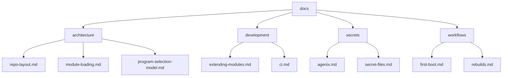

# Documentation

- [Documentation](#documentation)
  - [Recommended reading order](#recommended-reading-order)
  - [Documentation Structure](#documentation-structure)
  - [Architecture](#architecture)
  - [Development](#development)
  - [Secrets](#secrets)
  - [Workflows](#workflows)

This documentation is split into sections covering architecture, workflows, secrets management, and development.

## Recommended reading order

New to the repository? Start here:

1. [Repository layout](architecture/repo-layout.md)
2. [Program selection model](architecture/program-selection-model.md)
3. [Dynamic module loading](architecture/module-loading.md)
4. [Rebuild workflows](workflows/rebuilds.md)
5. [Agenix setup](secrets/agenix.md)

After that, use the remaining documentation as reference material.

## Documentation Structure

## Architecture

Start here for understanding how the repository is structured and how configuration is composed.

| Document | Purpose |
|---|---|
| [repo-layout.md](architecture/repo-layout.md) | High-level repository structure |
| [program-selection-model.md](architecture/program-selection-model.md) | User program selection architecture |
| [module-loading.md](architecture/module-loading.md) | Dynamic Home Manager module loading |

## Development

Documentation related to repository maintenance and extending functionality.

| Document | Purpose |
|---|---|
| [extending-modules.md](development/extending-modules.md) | Creating new modules |
| [ci.md](development/ci.md) | CI pipelines and validation |

## Secrets

Documentation covering encrypted secret management using Agenix.

| Document | Purpose |
|---|---|
| [agenix.md](secrets/agenix.md) | Agenix setup and usage |
| [secret-files.md](secrets/secret-files.md) | Secret file reference |

## Workflows

Operational workflows for rebuilding, bootstrapping, and maintaining systems.

| Document | Purpose |
|---|---|
| [first-boot.md](workflows/first-boot.md) | Initial system setup checklist |
| [rebuilds.md](workflows/rebuilds.md) | Rebuild and update workflows |
