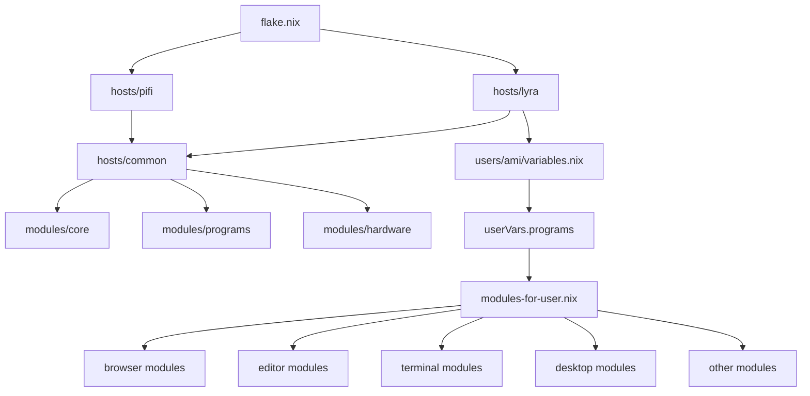

# Modules

- [Modules](#modules)
  - [Structure](#structure)
  - [Example](#example)
  - [Resolution rules](#resolution-rules)
    - [String values](#string-values)
    - [List values](#list-values)
    - [`programs.other`](#programsother)
  - [Adding new modules](#adding-new-modules)

This repository uses a dynamic Home Manager module loading system. Instead of importing every module manually, users declare program selections in:

```text
users/<name>/variables.nix
```

The loader then resolves and imports matching modules automatically, alongside common modules through `hosts/common`.



## Structure

```text
modules/
├── core/
├── hardware/
└── programs/
```

## Example

```nix
{
  programs = {
    compositor = "niri";
    terminal = "ghostty";
    editor = "hx";

    browsers = [
      "zen"
      "browseros"
    ];

    other = [
      "anki"
    ];
  };
}
```

## Resolution rules

### String values

Single string values load one module.

Example:

```nix
terminal = "ghostty";
```

maps to:

```text
users/programs/terminal/ghostty.nix
```

---

### List values

Lists load multiple modules.

Example:

```nix
browsers = [ "zen" "browseros" ];
```

maps to:

```text
users/programs/browser/zen.nix
users/programs/browser/browseros.nix
```

---

### `programs.other`

The `other` category maps directly to top-level modules.

Example:

```nix
other = [ "anki" ];
```

maps to:

```text
users/programs/anki.nix
```

## Adding new modules

1. Create a module:

```text
users/programs/<category>/<name>.nix
```

2. Add the program name into:

```text
users/<name>/variables.nix
```

No additional imports should be required.