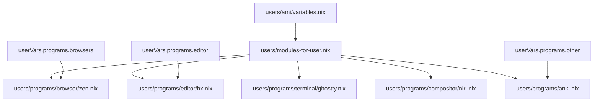

# Program Selection Model

- [Program Selection Model](#program-selection-model)
  - [Example](#example)
  - [Loading behaviour](#loading-behaviour)
    - [Rules](#rules)

Each user declares a small set of program choices in:

```text
users/<name>/variables.nix
```

Modules are then loaded dynamically based on those values.

## Example

```nix
{
  programs = {
    compositor = "niri";
    terminal = "ghostty";
    editor = "hx";
    browsers = [ "browseros" "zen" ];

    other = [
      "anki"
      "styles"
    ];
  };
}
```



## Loading behaviour

The loader is implemented in [users/modules-for-user.nix](../../users/modules-for-user.nix)

### Rules

- String values load a single module
- Lists load multiple modules
- `programs.other` maps directly to top-level modules
- Plural categories map to singular directories when needed

Example:

```nix
programs.browsers = [ "zen" "browseros" ];
```

maps to:

```text
users/programs/browser/zen.nix
users/programs/browser/browseros.nix
```