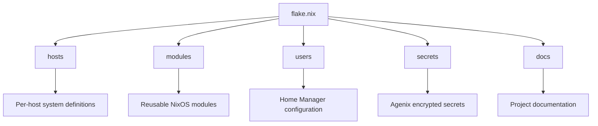

# Repository Layout

- [Repository Layout](#repository-layout)
  - [High-level structure](#high-level-structure)
  - [Directory responsibilities](#directory-responsibilities)

This configuration aims to:

- Keep user preferences declarative.
- Separate policy from implementation.
- Minimise hardcoded application assumptions.
- Make swapping components trivial.
- Share logic across hosts cleanly.

## High-level structure

## Directory responsibilities

| Path                  | Purpose                      |
|-----------------------|------------------------------|
| [`hosts/`](../../hosts)     | Per-host NixOS configuration |
| [`modules/`](../../modules) | Reusable NixOS modules       |
| [`users/`](../../users)     | Home Manager configuration   |
| [`docs/`](../../docs)       | Detailed documentation       |
| [`secrets/`](../../secrets) | Encrypted Agenix secrets     |