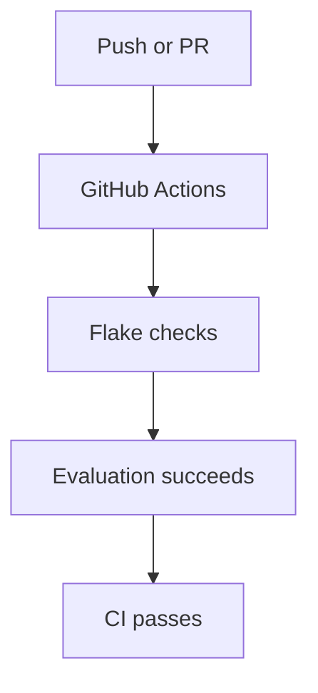

# Continuous Integration

- [Continuous Integration](#continuous-integration)
  - [CI overview](#ci-overview)
  - [Current workflow](#current-workflow)
  - [Goals](#goals)
  - [Suggested tooling](#suggested-tooling)
    - [Formatting](#formatting)
    - [Linting](#linting)
    - [Validation](#validation)
  - [Pre-commit hooks](#pre-commit-hooks)
  - [Example local validation](#example-local-validation)

This repository includes lightweight CI checks for flake hygiene, formatting, and evaluation.

## CI overview



## Current workflow

The repository currently includes:

```text
.github/workflows/flake-checker.yml
.github/workflows/nix-ci.yml
.github/workflows/alejandra-autoformat.yml
```

using:

- Determinate Systems flake checker
- `pre-commit run --all-files`
- `nix flake check --all-systems`
- automated `alejandra` commits on `main`

## Goals

The CI pipeline aims to:

- Catch broken flake inputs
- Validate repository structure
- Prevent accidental regressions
- Ensure configurations still evaluate


## Suggested tooling

### Formatting

- `alejandra`
- `treefmt`

### Linting

- `statix`
- `deadnix`

### Validation

- `nix flake check --all-systems`

## Pre-commit hooks

This repository also exposes a real pre-commit setup via https://pre-commit.com.

The hook set currently runs:

- `alejandra`
- `statix`
- `deadnix`

Each hook runs `nix develop --command ...`, so the Nix packages from the flake
dev shell are available even when the commit is launched outside `nix develop`.

To install the hooks once:

```bash
pre-commit install
```

To run them manually:

```bash
pre-commit run --all-files
```

## Example local validation

Run checks locally before pushing:

```bash
nix run nixpkgs#alejandra -- --check .
nix run nixpkgs#statix -- check .
nix run nixpkgs#deadnix -- .
nix flake check --all-systems
```

Linting:

```bash
nix run nixpkgs#statix -- check .
nix run nixpkgs#deadnix -- .
```

Note: these lint tools currently emit warnings in the existing tree, so they are
kept advisory in CI until the repo is cleaned up.

Formatting:

```bash
nix run nixpkgs#alejandra -- .
```
