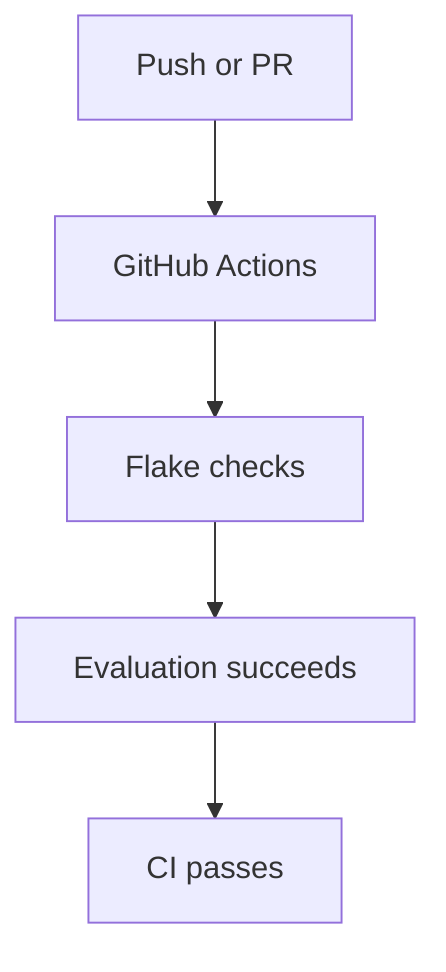
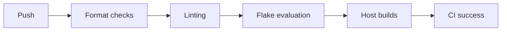

# Continuous Integration

- [Continuous Integration](#continuous-integration)
  - [CI overview](#ci-overview)
  - [Current workflow](#current-workflow)
  - [Goals](#goals)
  - [Future improvements](#future-improvements)
  - [Example future workflow](#example-future-workflow)
  - [Suggested tooling](#suggested-tooling)
    - [Formatting](#formatting)
    - [Linting](#linting)
    - [Validation](#validation)
  - [Example local validation](#example-local-validation)

This repository includes lightweight CI checks for flake hygiene and evaluation.

## CI overview



## Current workflow

The repository currently includes:

```text
.github/workflows/flake-checker.yml
```

using:

- Determinate Systems flake checker

## Goals

The CI pipeline aims to:

- Catch broken flake inputs
- Validate repository structure
- Prevent accidental regressions
- Ensure configurations still evaluate

## Future improvements

Potential future additions:

| Feature | Purpose |
|---|---|
| `nix flake check` | Validate flake outputs |
| Host evaluation matrix | Test all hosts |
| Dead link checker | Validate documentation |
| Formatting checks | Enforce style consistency |
| Statix | Nix linting |
| Deadnix | Detect unused code |
| Treefmt | Unified formatting |
| Cachix integration | Binary cache uploads |

## Example future workflow



## Suggested tooling

### Formatting

- `alejandra`
- `treefmt`

### Linting

- `statix`
- `deadnix`

### Validation

- `nix flake check`

## Example local validation

Run checks locally before pushing:

```bash
nix flake check
```

Linting:

```bash
statix check .
deadnix .
```

Formatting:

```bash
alejandra .
```
