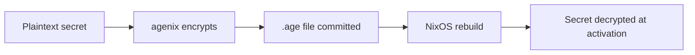
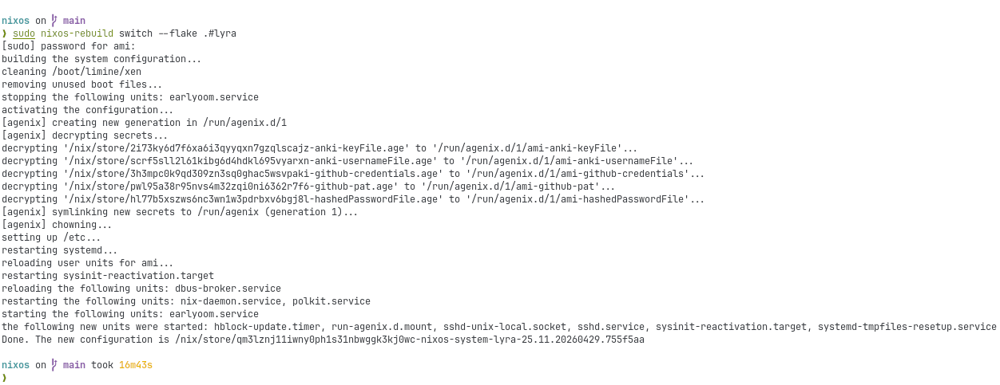

# Agenix Setup

- [Agenix Setup](#agenix-setup)
  - [How this repository uses Agenix](#how-this-repository-uses-agenix)
  - [1. Ensure the CLI exists](#1-ensure-the-cli-exists)
  - [2. Add host public keys](#2-add-host-public-keys)
  - [3. Rekey secrets](#3-rekey-secrets)
  - [4. Create or edit secrets](#4-create-or-edit-secrets)
  - [5. Rebuild](#5-rebuild)

Secrets are managed using Agenix. Encrypted secret files live under:

```text
secrets/<username>/<name>.age
```



## How this repository uses Agenix

- Secrets are committed encrypted
- NixOS imports `modules/core/agenix.nix`
- Decryption uses host SSH keys



## 1. Ensure the CLI exists

This repository includes the Agenix CLI in common packages.

After rebuilding:

```bash
agenix
```

should be available.

## 2. Add host public keys

Get the host public key:

```bash
sudo cat /etc/ssh/ssh_host_ed25519_key.pub
```

If keys do not exist:

```bash
sudo ssh-keygen -A
```

Add the public key to:

```text
secrets/secrets.nix
```

## 3. Rekey secrets

```bash
export RULES="$PWD/secrets/secrets.nix"
agenix -r
```

If host-key encrypted:

```bash
export RULES="$PWD/secrets/secrets.nix"
sudo /nix/var/nix/profiles/default/bin/nix run github:ryantm/agenix -- -r -i /etc/ssh/ssh_host_ed25519_key
```

## 4. Create or edit secrets

```bash
export RULES="$PWD/secrets/secrets.nix"
```

Examples:

```bash
agenix -e secrets/ami/github-pat.age
agenix -e secrets/ami/gh-hosts.yml.age
```

## 5. Rebuild

```bash
sudo nixos-rebuild switch --flake .#lyra
```
